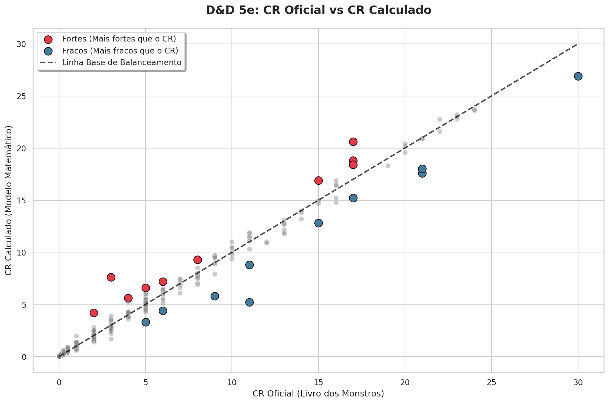
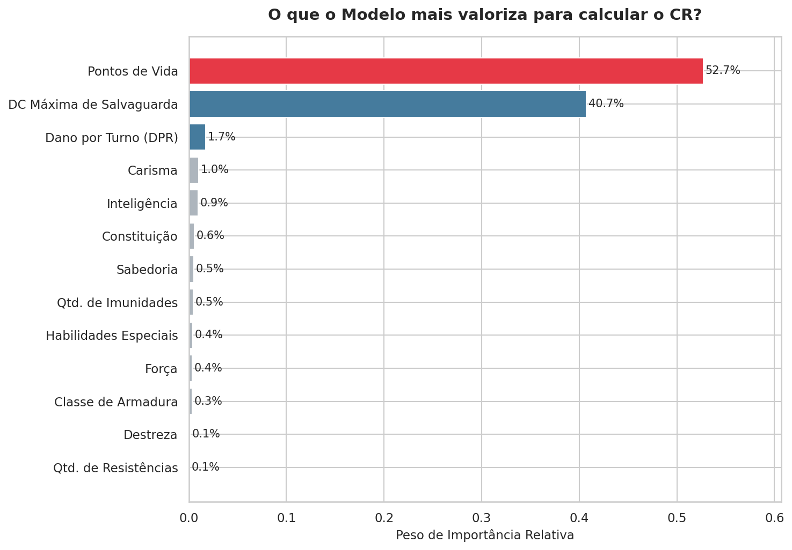

# D&D 5e: Análise de Balanceamento de Monstros com Machine Learning



---

## 1. Descrição

Este é um projeto completo de ciência de dados que aplica Machine Learning para auditar o sistema de **Challenge Rating (CR)** do *Dungeons & Dragons 5ª Edição*, a métrica oficial usada pela Wizards of the Coast para classificar a dificuldade de cada monstro.

O pipeline extrai os atributos de 322 monstros oficiais do SRD (System Reference Document 5.1) via API pública, constrói features numéricas a partir de texto livre com técnicas de NLP leve (normalização, Regex em múltiplas camadas e Fuzzy Matching), e treina um modelo Random Forest para prever o CR matematicamente esperado de cada criatura, revelando quais monstros estão super ou subestimados em relação ao que os dados sugerem.

---

## 2. Tecnologias e Ferramentas

- **Linguagem:** Python
- **Bibliotecas:** Pandas, NumPy, Scikit-Learn, Matplotlib, Seaborn, Requests, Re, Difflib, Ast
- **Ambiente:** Jupyter Notebook
- **Controle de versão:** Git e GitHub
- **Fonte de dados:** [Open5e API](https://open5e.com/), repositório open source do SRD oficial da WotC
- **Técnicas:** Engenharia de atributos via NLP, Random Forest Regressor, análise de discrepância

---

## 3. Problema e Objetivo

### 3.1 Qual é o problema?

O sistema de CR do D&D 5e é definido manualmente pela Wizards of the Coast e funciona como um guia para Mestres montarem encontros equilibrados. Um monstro de CR 5 deveria representar um desafio equivalente a um grupo de quatro aventureiros de nível 5.

Na prática, jogadores e mestres experientes sabem que esse sistema apresenta inconsistências, algumas criaturas são notoriamente mais perigosas do que o CR indica, enquanto outras são surpreendentemente fracas. O problema é que não existia, até então, uma análise quantitativa e reproduzível que identificasse essas discrepâncias de forma sistemática.

### 3.2 Quais são os objetivos do projeto?

1. Construir um pipeline de extração e engenharia de atributos a partir dos dados brutos da API.
2. Capturar o "poder oculto" de monstros com habilidades especiais (magias, imunidades, DCs de salvaguarda) em features numéricas.
3. Treinar um modelo capaz de prever o CR esperado com base nos atributos reais de cada criatura.
4. Identificar e classificar monstros com discrepância significativa entre o CR oficial e o CR calculado.

### 3.3 Por que isso importa?

A análise gera valor direto para mestres de D&D que querem montar encontros realmente equilibrados, e demonstra como técnicas de ciência de dados podem ser aplicadas em domínios não convencionais, extraindo estrutura de texto livre e convertendo regras narrativas em features matemáticas.

---

## 4. Pipeline da Solução

1. **Extração via API**: coleta paginada de todos os monstros da Open5e com delay de cortesia entre requisições
2. **Filtragem**: isolamento dos 322 monstros oficiais WotC SRD, removendo conteúdo de editoras terceiras
3. **Engenharia de Atributos**: construção de features numéricas a partir de texto livre:
   - `dpr_maximo`: NLP em 3 camadas para interpretar descrições de Multiattack
   - `save_dc_max`: DC máxima de salvaguarda extraída por Regex de habilidades e feitiços
   - `qtd_imunidades` / `qtd_resistencias`: busca nominal nos 13 tipos de dano oficiais
   - `qtd_habilidades_especiais`: contagem de habilidades passivas
4. **Treinamento**: Random Forest Regressor com divisão 80/20 entre treino e teste
5. **Análise de Discrepância**: comparação entre CR oficial e CR calculado para identificar monstros fora do lugar

Cada etapa está documentada nos notebooks com a justificativa das decisões tomadas.

---

## 5. O Desafio de Engenharia: NLP sem Dependências Externas

O maior obstáculo técnico do projeto foi calcular o **Dano por Turno (DPR)** de monstros com Multiattack. O texto livre da API é altamente inconsistente, um monstro escreve *"two claw attacks"*, outro *"makes two attacks with its claws"*, outro *"twice with its claws"*.

A solução foi um micropipeline de NLP em três camadas, construído apenas com bibliotecas padrão do Python, garantindo reprodutibilidade total no Kaggle e GitHub:

1. **Normalização:** remove ruído gramatical (*makes, attacks, its, with*) sem afetar marcadores de frequência (*two, three, once, twice*).
2. **Regex Direto:** número antes do nome do ataque — `"two claw"`.
3. **Regex Reverso:** número depois do nome — `"claw two"`.
4. **Fuzzy Matching (`difflib`):** casa nomes com variações ortográficas ou de plural nas proximidades do texto.

Essa arquitetura de defesa em camadas resolveu os casos de falha silenciosa do padrão original sem inflar o projeto com dependências pesadas como spaCy ou NLTK.

---

## 6. Principais Descobertas

### 6.1 O que o modelo mais valoriza?



O resultado revela a mecânica central do sistema de CR: **Pontos de Vida (52.7%) e DC Máxima de Salvaguarda (40.7%) juntos explicam 93% do peso do modelo.**

Isso confirma que o D&D 5e foi projetado em torno de dois eixos fundamentais, o quanto uma criatura aguenta antes de morrer, e o quanto ela força os jogadores a rolar dados de salvaguarda. O Dano por Turno, surpreendentemente, representa apenas 1.7% do peso, sugerindo que a editora prioriza durabilidade e controle sobre poder ofensivo puro.

### 6.2 Monstros fora do lugar


**🔴 Mais fortes que o CR indica**

| Monstro | CR Oficial | CR Calculado | Discrepância |
|---------|-----------|--------------|--------------|
| Green Hag | 3 | 7.6 | +4.6 |
| Dragon Turtle | 17 | 20.6 | +3.6 |
| Gelatinous Cube | 2 | 4.2 | +2.2 |

**🔵 Mais fracos que o CR indica**

| Monstro | CR Oficial | CR Calculado | Discrepância |
|---------|-----------|--------------|--------------|
| Chain Devil | 11 | 5.2 | -5.8 |
| Lich | 21 | 17.6 | -3.4 |
| Tarrasque | 30 | 26.9 | -3.1 |

> A tabela completa com todos os 322 monstros está disponível em `data/processed/ranking_completo.csv`.

### 6.3 Uma descoberta relevante

A persistência do **Lich** e do **Tarrasque** na lista de "fracos" não é falha do modelo, é uma conclusão analítica legítima. Essas criaturas têm poderes situacionais (Rejuvenescimento, reflexo de magias, imunidade a encantamento) que nenhuma feature numérica captura completamente. O CR oficial deles incorpora o impacto psicológico e estratégico dessas mecânicas, não apenas os números brutos.

---

## 7. Desempenho do Modelo

O modelo final atingiu **MAE de 0.73 níveis de CR** e **R² de 0.95** nos dados de teste, ou seja, erra em média menos de um nível de CR por monstro, com 95% da variância explicada pelos atributos.

---

## 8. Como Reproduzir

**Pré-requisitos:** Python 3.8+, pip

```bash
# 1. Clone o repositório
git clone https://github.com/SEU_USUARIO/SEU_REPOSITORIO.git
cd SEU_REPOSITORIO

# 2. Instale as dependências
pip install requests pandas scikit-learn matplotlib seaborn

# 3. Execute os notebooks em ordem
# Notebook 01: extração da API e engenharia de atributos
# Notebook 02: treinamento do modelo e análise de discrepância
```

> **Nota:** O notebook 01 faz requisições à API pública da Open5e. A extração completa pode levar alguns minutos devido à paginação e ao delay de cortesia entre requisições.

---

## 9. Fonte dos Dados

Os dados foram extraídos da API pública [Open5e](https://open5e.com/), filtrando apenas monstros do documento `wotc-srd`, o System Reference Document 5.1, conteúdo oficial liberado pela Wizards of the Coast sob licença Creative Commons.

---

## 10. Contato

**LinkedIn:** [linkedin.com/in/caio-r-costa](https://www.linkedin.com/in/caio-r-costa/)

**GitHub:** [github.com/CaioRCosta](https://github.com/CaioRCosta)

**E-mail:** caiorcwork@gmail.com
